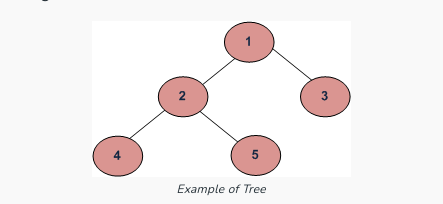

# Height of Binary Tree

## [GFG](https://www.geeksforgeeks.org/find-the-maximum-depth-or-height-of-a-tree/)



```
maxDepth(‘1’) 
    = max(maxDepth(‘2’), maxDepth(‘3’)) + 1 
    = max(maxdepth(4),maxdepth(5)) + 1
    + maxdepth(3) +1
    = 0 + 0 + 1
    + 0 + 1
    = 2
```