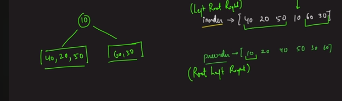

# Construct Binary Tree from Preorder and Inorder Traversal	

**Note  : NUMBERS MUST BE UNIQUE !!!**

'''
In preorder, the leftmost is the root. Which can split the inorder.



```
createTree(in[],pre[],i,j)
    int k = searchIndexInPre(pre,in[i]);

```
```c
node constructTree(int preorder[], int preStart, int preEnd, int inorder[], int inStart, int inEnd) {
    if (preStart > preEnd || inStart > inEnd)
        return NULL;

    node root = newNode(preorder[preStart]);
    int elem = search(inorder, inStart, inEnd, root.data);

    root.left = constructTree(preorder, preStart + 1, preStart + elem - inStart, inorder, inStart, elem - 1);
    root.right = constructTree(preorder, preStart + elem - inStart + 1, preEnd, inorder, elem + 1, inEnd);

    return root;
}

```


