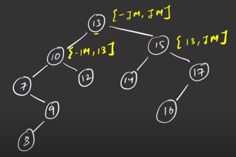

# 8 Check BT for BST

[GFG]()  
[Leetcode]()  
[Code]()

### How to check if Binary tree is a BST or not ?

## > For each node, find the range of numbers it can have icluding the node's value.

Starting with (INTMIN,INTMAX)

in left, range is (INTMIN, 13)
in right , range is (13,INTMAX)


### Note : Start with INT_MIN and INT_MAX for the root node

```cpp
//c++ code
bool f(TreeNode * root, long a, long b){
        if(root==NULL)
            return true;
        if(root->val > a && root->val < b)
            return true && f(root->left,a,root->val) && f(root->right,root->val,b);
        else
            return false;
    }
    bool isValidBST(TreeNode* root) {
       return f(root,long(INT_MIN)-1,long(INT_MAX)+1);
    }
```