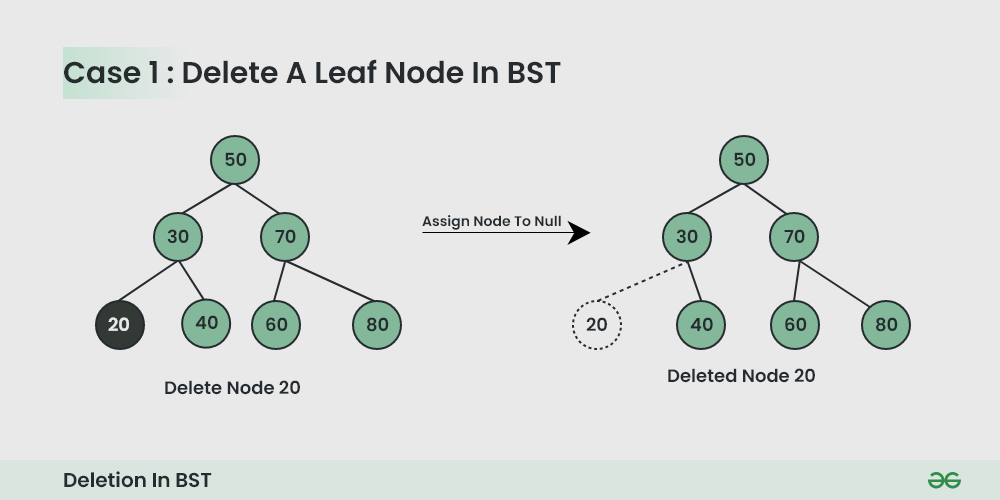
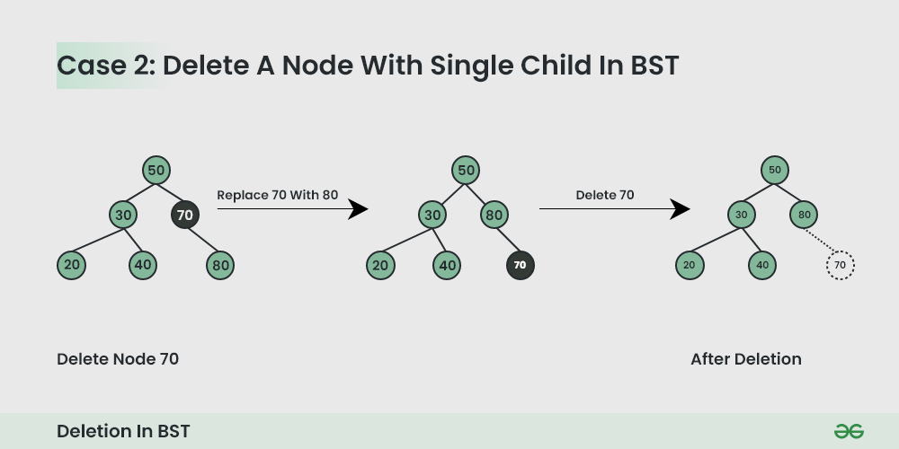
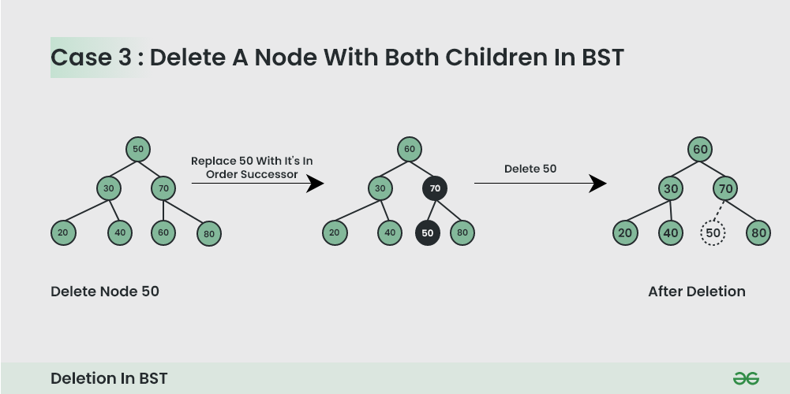

# CASE 3 : 

### Replace by Inorder successor OR Inorder predecessor
# Inorder successor of a element in BST

### [GFG](https://www.geeksforgeeks.org/inorder-successor-in-binary-search-tree/)

### The node with the **smallest key greater than the key** of the input node. 

First go right then go as left as you can.