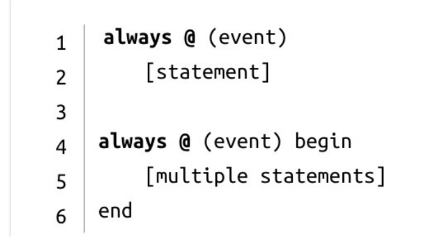
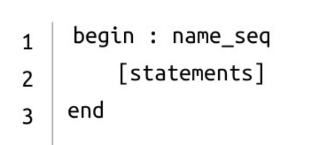
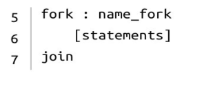
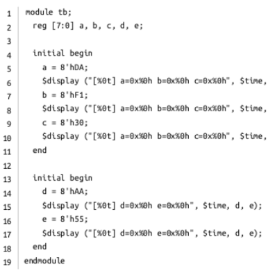
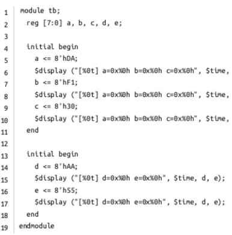

# 3. Pre-Requisite Verilog Commands
## 3.1 Initial
A set of Verilog statements are usually executed sequentially in a simulation.
These statements are placed inside a procedural block. Initial is one of the two
main types of procedural block statements. An initial block is not synthesizable
and hence cannot be converted into a hardware schematic with digital elements.
Hence initial blocks do not serve much purpose than to be used in simulations.
These blocks are primarily used to initialize variables and drive design ports
with specific values.This block will be executed only once during the entire
simulation. Execution of an initial block finishes once all the statements within
the block are executed.
The syntax is shown in figure 3.1:

Fig 3.1

## 3.2 Always
- procedural blocks in Verilog. 
- Statements inside are executed sequentially. 
- The always block is executed at some particular event defined in the **sensitivity list**.
### Sensitivity list 
    is the expression that defines when the always block should be executed and is specified after the @ operator within parentheses ( ) . 
-  may contain either one or a group of signals whose value change will
execute the always block.
An always block can be used to realize combinational or sequential elements. A
sequential element like flip flop becomes active when it is provided with a clock
and reset. Similarly, a combinational block becomes active when one of its
input values change. These hardware blocks are all working concurrently
independent of each other. The connection between each is what determines the
flow of data. 

To model this behavior, an always block is made as a continuous
process that gets triggered and performs some action when a signal within the
sensitivity list becomes active. The syntax is displayed in Fig 3.2

  
Fig 3.2

## 3.3 Begin..End
- The Curly Brackets of verilog  
  
Fig 3.3

## 3.4 Fork..Join (Never Used)
Statements are launched in parallel by wrapping them within the join and fork
keywords. A parallel block can execute statements concurrently and delay
control can be used to provide time-ordering of the assignments. The syntax is
shown in Fig 3.4
  
Fig 3.4

## 3.5 Blocking Statements:
Blocking assignment statements are assigned using = and are executed one after
the other in a procedural block. However, this will not prevent execution of
statments that run in a parallel block. For eg:  

```
module tb;
    reg [7:0] a, b, c,d,
    initial begin
        a= 8'hDA;
        Sdisplay ("[%0t] a=0x%0h b=0x%0h c=0x%0h, Stime,
        b= 8'hF1;
        Sdisplay (“%0t] a=0x3h b=xxh c=0x¥Oh", Stime,
        c= 8'30;
        Sdisplay ("[%6t] a=0xah b=@xX6h c=0x¥ON", Stime,
    end
    initial begin
        d= 8h;
        Sdisplay (“[%6t] d=xuh e=Bxxoh”, Stime, d, ©);
        = Bohs;
        Sdisplay ("[%6t] d=xih e=@xxgh”, Stime, d, ©);
    end
endmodule
```

  
Fig 3.5

In the above example, there are two initial blocks which are executed in parallel
when simulation starts. Statements are executed sequentially in each block
and both blocks finish at time 0ns. To be more specific, variable a gets assigned
first, followed by the display statement which is then followed by all other
statements.
## 3.6 Non-Blocking Statements:

Non-blocking assignment allows assignments to be scheduled without blocking
the execution of following statements and is specified by a <= symbol. It's
interesting to note that the same symbol is used as a relational operator in
expressions, and as an assignment operator in the context of a non-blocking
assignment. The following code snippet is written by replacing all the blocking
statements in the previous example by non blocking statements. Try out for
yourself and compare the difference in the outputs :-) .
  
Fig 3.6

## 3.7 Posedge and Negedge:
Simply speaking,
posedge means the transition from 0 to 1
negedge the oposit transition from 1 to 0
In synchronous sequential circuits, changes in flip-flops
occur only in response to a transition of a clock pulse. The transition may be
either a positive edge or a negative edge of the clock, but not both. Verilog HDL
takes care of these conditions by providing these two keywords viz. posedge
and negedge. The syntax is shown in Fig 3.7


Fig 3.7

## 3.8 Case Statement:
The case statement checks if the given expression matches one of the other
expressions in the list and branches accordingly. It is typically used to
implement a multiplexer. The if-else construct may not be suitable if there are
many conditions to be checked and would synthesize into a priority encoder
instead of a multiplexer.

Fig 3.8

The syntax is shown in Fig 3.8. A Verilog case statement starts with the
keyword case and ends with the endcase keyword. The expression within
parantheses will be evaluated exactly once and is compared with the list of
alternatives in the order they are written and the statements for which the
alternative matches the given expression are executed. A block of multiple
statements must be grouped and be within begin and end.
If none of the case items match the given expression, statements within the
default item is executed. The statement is optional, and there can be only one
default statement in a case statement.

